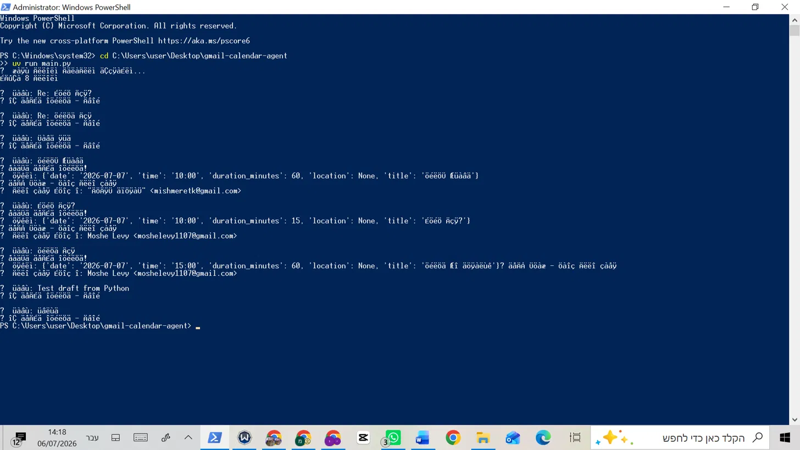
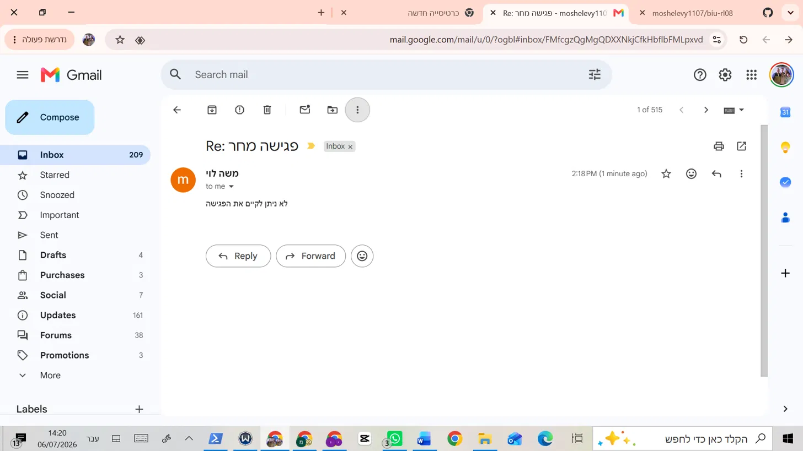
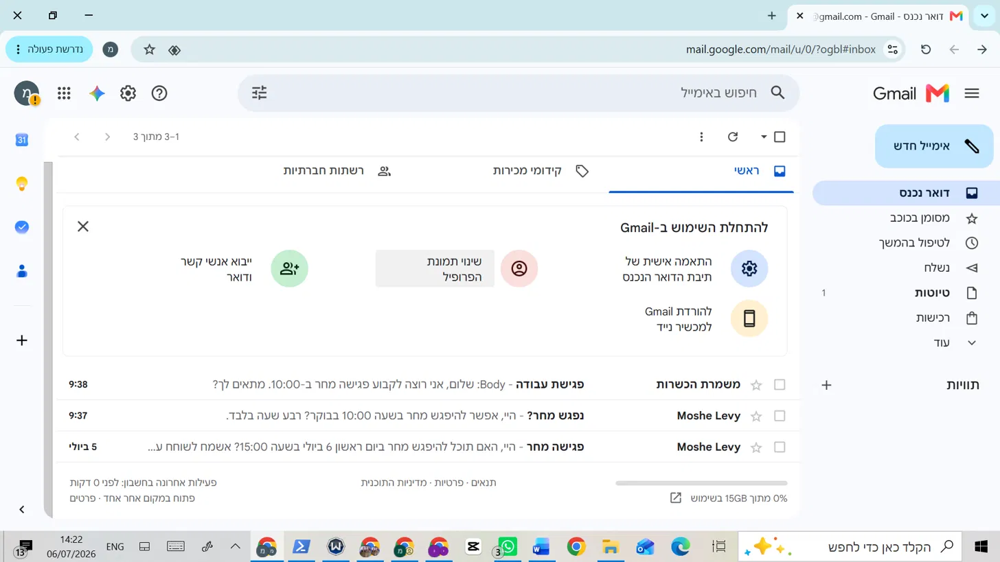
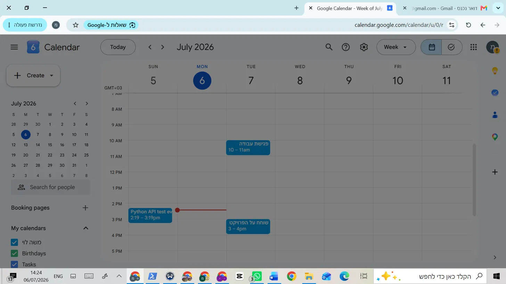

Result: Calendar event created successfully for the requested time slot.

### Conflict test (already passed ✅)
Sent two emails requesting the same time slot:
- First email → Calendar event created
- Second email → Decline reply sent automatically: "לא ניתן לקיים את הפגישה"

### Relative date test (already passed ✅)
Sent email with "מחר בשעה 10:00" — agent correctly resolved to exact date `2026-07-07`.

---

## 🛠️ Troubleshooting

| Error | Cause | Fix |
|---|---|---|
| `Access blocked` / `This app isn't verified` | App in Testing mode, account not listed | Add Gmail account to Test Users in Google Auth Platform → Audience |
| `invalid_grant` or auth fails | Stale `token.json` | Delete `token.json` and re-run |
| `insufficient authentication scopes` | Old token with outdated scopes | Delete `token.json`, verify Scopes in Google Auth Platform → Data access, re-run |
| `429 RESOURCE_EXHAUSTED` | LLM free tier daily limit | Wait ~24h for quota reset |

---

## 📋 Assignment Compliance

| Requirement (L08 Spec) | Implementation |
|---|---|
| Scan Gmail inbox, last 2 days only | `gmail.users().messages().list()` with `newer_than:2d` query |
| Identify free-text meeting invitations | Rule pre-filter + Claude LLM classification |
| Extract date, time, participants, location | Claude structured prompt with relative date support |
| Check Google Calendar availability | `calendar.freebusy().query()` |
| Create event if available | `calendar.events().insert()` on `primary` calendar |
| Send decline if busy | `gmail.users().messages().send()` with reply headers |
| Use dedicated Gmail account (not Outlook/corporate) | `myproject.agent2026@gmail.com` |
| OAuth token-based authentication | `InstalledAppFlow` → `token.json` |
| Mandatory fields: date + time | Agent skips if either is missing |
| Hybrid detection (rules + LLM) | Implemented — exceeds 40% rule-only threshold |

---
---

## 📸 Screenshots — תיעוד פעולת המערכת

### 1. הרצת הסוכן — פלט הטרמינל

הסוכן סרק את תיבת הדואר הנכנס וזיהה **8 מיילים** בשני הימים האחרונים.

**שיפור מרכזי — טיפול בתאריכים יחסיים:**  
הסוכן מסוגל לפרש ביטויים כגון `"מחר"`, `"ביום שלישי הקרוב"` ולהמיר אותם לתאריך מדויק.  
לדוגמה: המייל "נפגש מחר?" שנשלח ב-06/07/2026 → הסוכן זיהה תאריך `2026-07-07` אוטומטית.

### 2. מייל דחייה אוטומטי

כאשר החריץ ביומן **תפוס**, הסוכן שלח תשובה: **"לא ניתן לקיים את הפגישה"**

### 3. תיבת הדואר הנכנס

### 4. Google Calendar — אירוע שנוצר אוטומטית

אירוע **"פגישת עבודה"** נוצר ביום שלישי 7/7/2026 בשעות 10:00–11:00 אוטומטית.

## 👤 Author

**Solo project** — submitted individually per assignment requirements.
Group code: `biu-rl08`
Course: Dr. Yoram Segal — AI Systems, 2026

---

*All rights reserved to the course material: © Dr. Yoram Segal 2026*